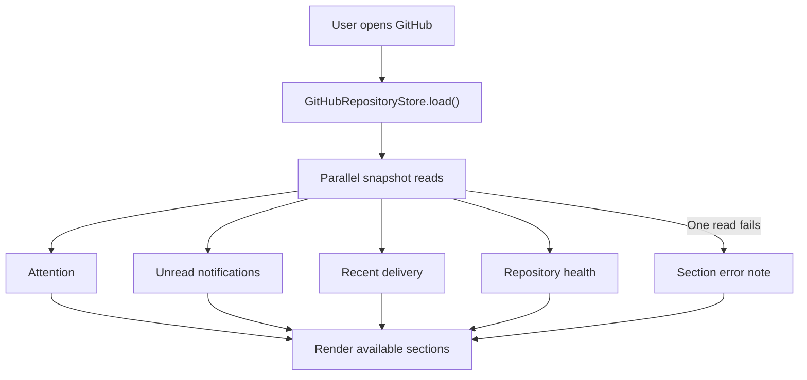

# Atrium interface

How the SwiftUI interface in `macos/Sources/Atrium/` is built and verified. [DESIGN.md](DESIGN.md) owns how it must look and feel. [docs/architecture.md](docs/architecture.md) owns the whole system. [AGENTS.md](AGENTS.md) owns commands and done criteria.

## Topology

`AtriumApp` declares three scenes and owns every long-lived object:

| Scene | Root view | Purpose |
| --- | --- | --- |
| `WindowGroup("Atrium", id: "workspace")` | `ContentView` | The workspace window |
| `Settings` | `SettingsView` | Preferences, providers, permissions |
| `MenuBarExtra` | `MenuBarView` | Recording control and Ask from the menu bar |

`AppStore` is created in `AtriumApp.init()` and lives for the process. A failed initializer shows `ContentUnavailableView` in place of the workspace, so the application opens without local data. `UpdaterService` is created beside it. `CompanyHubStore` is created in `ContentView` and passed down through `.environment(hub)`.

`ContentView` holds one `NavigationSplitView`. `SidebarView` writes `store.selection`, and the `detail` switch over `WorkspaceSelection` selects the screen. Menu commands and the menu bar reach the same screens through `store.select(_:)`.

## Layer boundaries

| Layer | Location | May depend on | Leaves elsewhere |
| --- | --- | --- | --- |
| View | `Sources/Atrium/Views/` | Store state, semantic store actions, `BrandStyle` | Database access, audio, transcription, network calls |
| Store | `Sources/AtriumCore/Stores/` | Models and service types | SwiftUI types and presentation state |
| Service | `Sources/AtriumCore/Services/` | System frameworks, SQLite, transport | Presentation state |
| Support | `Sources/Atrium/Support/` | AppKit and system events | A second copy of store state |

The dependency runs one way, from `Atrium` to `AtriumCore`. A view reaches data through a store. Company Hub views read `CompanyHubStore` only, and they stay away from the local database.

## Feature map

| Feature | Source root | Selection | Store | Service boundary |
| --- | --- | --- | --- | --- |
| Home | `Views/Home/` | `.home` | `AppStore` and `CompanyHubStore` | Both |
| Ask Atrium | `Views/AskView.swift` | `.ask` | `AppStore` | `LanguageProviderService`, `SQLiteDatabase` |
| Dictation | `Views/DictationView.swift` | `.dictation` | `AppStore` | `SpeechTranscriptionService` |
| Meeting notes | `Views/MeetingNotesView.swift` | `.notes` | `AppStore` | `SQLiteDatabase` |
| Meeting workspace | `Views/MeetingDetailView.swift` | `.meeting(id)` | `AppStore` | Audio, speech, summary, database |
| Company Hub | `Views/CompanyHub/` | `.company`, `.github`, `.sharedContext`, `.people`, `.search`, `.activity` | `CompanyHubStore`, `GitHubRepositoryStore` | `CompanyHubProviding`, `GitHubRepositoryService` |
| Bongi - Local Agent | `Views/CompanyHub/AgentsView.swift` | `.agents` | None while setup is pending | Office-local agent connection, not built |
| Onboarding, settings, updates | `Views/OnboardingView.swift`, `Views/SettingsView.swift`, `Support/UpdaterService.swift` | Scene-level | `AppStore`, `UpdaterService` | Permissions, GitHub CLI |

## State ownership

`AppStore` is the single source of truth for My Workspace. It is `@MainActor @Observable`, and every fact a view renders is `public private(set)`. Views mutate state through the semantic actions, such as `startRecording()`, `saveNote(markdown:)`, `answerQuestion(...)`, and `select(_:)`. Only `selection`, `searchText`, and `errorMessage` are writable directly.

`CompanyHubStore` holds Company Hub state and reads through `CompanyHubProviding`. `DisconnectedCompanyHubService` is the default, so every collection stays empty and every write reports `CompanyHubUnavailableError`. `isConnected` tells a view whether to disable a share, message, or read action.

View-local state stays in the view: a draft question, a selection set, a sheet flag. User preferences that survive relaunch use `@AppStorage`, such as `ubundi-meet-brand-theme`, `notive.appearance`, and `notive.onboarding.complete`. Meetings, transcripts, notes, and summaries survive relaunch in SQLite.

Representative flows:

```text
User selects Ask
  → store.retrieveAskEvidence(question:scope:)
  → SQLiteDatabase FTS5 search
  → store.answerQuestion(...)
  → askPhase becomes .confirming for an external provider
  → store.confirmExternalAsk() sends the question and evidence
  → askAnswer holds claims with cited evidence
  → AskView renders claims and citations
```



Long operations hold their task on the store and compare an operation identifier before they publish a result, so a cancelled or superseded run writes nothing: `cancelAsk()`, `cancelSummary()`, `cancelRetranscription()`, `cancelDictation()`, `cancelRecording()`, and `cancelImport()`. A view that starts its own task cancels it in `onDisappear`, as `AskView` does.

## Add a screen

1. Add the case to `WorkspaceSelection` in `AtriumCore/Models/`.
2. Add the semantic action and published state to `AppStore` or `CompanyHubStore`. Keep transport and persistence in a service.
3. Add the row to `SidebarView` and the case to the `detail` switch in `ContentView`.
4. Compose the screen from `BrandScreen`, `AtriumPageHeader`, and `BrandPanel`. Company Hub screens also use the `Hub*` components.
5. Handle the empty, loading, error, and disabled states the feature can reach.
6. Add a `CommandMenu` item when the screen needs a keyboard route.
7. Add tests for the store or service behavior in `macos/Tests/`.

## Canonical examples

- `Views/Home/HomeView.swift` composes both stores on one screen and keeps the shared column empty while the hub is disconnected.
- `Views/AskView.swift` shows the asynchronous pattern: a view-owned task, the external confirmation gate, cancellation on disappear, and cited results.
- `Views/CompanyHub/AgentsView.swift` shows the Bongi setup placeholder. It has no connection or message action until the office-local agent contract is defined.

## Interface states

Every screen that reads data covers initial, loading, loaded, empty, and error. Disconnected Company Hub screens use `HubEmptyState.notConnected(...)` so a blank surface always explains itself, and they disable `Share to hub` and `Mark all read` while `isConnected` is `false`. Bongi is a separate disabled setup placeholder; it must not use the Company Hub provider or represent a cloud agent. GitHub is the connected-system exception: it reads repository, pull request, issue, unread notification, release, and workflow metadata through the authenticated `gh` session checked during onboarding. Dashboard snapshots stay in memory, while `gh` can cache repository detail for five minutes. Independent sections keep successful results visible when one read fails. It refreshes stale or partial data when the app becomes active, retries failed loads on revisit, and cancels its `gh` process when the view task is cancelled. Personal favourite repository identifiers persist in local preferences.

`ContentView` shows recoverable errors as an `ErrorBanner` above the detail column, one for each store. A banner names the action that failed and, when Atrium wrote a sentence for that failure, the cause. Permission-denied is a state of its own: recording, dictation, and system audio depend on Microphone, Speech Recognition, Screen Recording, and Accessibility access, and the screen sends the user to **Atrium → Settings → Permissions**.

Capture has two states of its own. When macOS has not granted Screen Recording access, `startRecording()` stops before it records and `recordingBlockedBySystemAudioAccess` becomes true, so `RecordingControlsView` offers Screen Recording settings or `startMicrophoneOnlyRecording()` instead of a plain start. When transcription fails after it recognized some speech, the meeting keeps that transcript, capture returns to `.idle`, and the banner asks the user to transcribe again; only a failure with no recognized speech reaches `.failed`. A transcript that arrives in parts appears on the meeting screen while transcription continues.

Keep native list selection, focus order, and keyboard operation. Give an icon-only control an `accessibilityLabel`, and hide decoration with `accessibilityHidden(true)`. First Motive is dark-only; Ubundi supports the system light and dark appearance.

## Performance and lifecycle

- The window has a 960 by 640 point minimum. Layout uses `ViewThatFits` for the two-column screens.
- Live transcript segments and meter values update many times each second. Keep them in a narrow subview so the whole screen stays off the render path.
- `MeetingDetailView` uses `.id(meetingID)` so a different meeting builds a fresh view.
- Audio playback, recording, and transcription belong to `AppStore` for the process lifetime, not to a view.

## Verify

Run the checks in [AGENTS.md](AGENTS.md). Store and service behavior is covered by `macos/Tests/`; SwiftUI views have no automated coverage, so exercise a changed screen in the running application with `./script/build_and_run.sh run`.

Check the screen in both themes and in both macOS appearances where the theme permits it, at the minimum window size, with the keyboard alone, and in its empty and error states. Read `./script/build_and_run.sh --logs` while you exercise the change. Run `./script/build_and_run.sh --verify` when the change touches bundle resources, signing, permissions, or startup.
