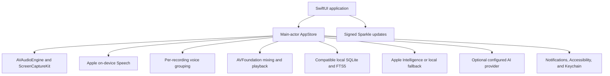

# System architecture

Notive is a native macOS application built with Swift 6.1 and SwiftUI. The `Notive` target owns scenes and views. The `NotiveCore` target owns local data, audio, transcription, retrieval, and language services. Sparkle is the only production Swift package dependency.

## Components

### Application interface

SwiftUI provides the workspace window, Settings scene, menu-bar controls, onboarding, meetings, Ask, notes, summaries, playback, and Local Dictation. AppKit is used only for narrow macOS integration such as folders, the clipboard, and global keyboard events.

### Audio and transcription

`AVAudioEngine` records the selected microphone. `ScreenCaptureKit` records system audio after macOS grants access. `AVFoundation` creates the playback file and plays saved or imported audio. Apple Speech performs on-device live and final transcription. Imported audio is copied to a meeting folder before transcription. Import cancellation removes the partial copy and database record but never changes the source file.

Voice grouping uses acoustic features from the current recording. It creates anonymous labels such as `Speaker 1`, keeps no identity profile, and does not compare people across meetings. User-entered aliases apply only to one meeting.

### Local data

Notive uses the existing SQLite database below `~/Library/Application Support/com.ubundi.meet/`. The native code reads and writes the compatible meetings, transcripts, notes, summaries, speaker aliases, and FTS5 search tables. No database import or rewrite is required.

Recording files use `~/Movies/notive-recordings/` by default. The user can select another local folder. Disabling saved audio removes only files created by the recorder after transcription completes. Imported source copies remain available for playback and retranscription.

### Ask and summaries

Ask retrieves a bounded set of local FTS5 evidence and nearby transcript context. Each generated claim must cite retrieved evidence. Apple Intelligence runs on device when it is available. A deterministic extractive implementation is the local fallback.

Ollama on a loopback address stays local. OpenAI, Anthropic, Groq, OpenRouter, remote Ollama, and custom OpenAI-compatible endpoints are external. API keys are stored in Keychain. Before the first external Ask request in an app session, Notive identifies the provider and requires confirmation before it sends the question and selected evidence.

### Updates and distribution

Swift Package Manager builds the native application. The release process embeds Sparkle 2.9.2, creates an Apple Silicon DMG and ZIP, and signs the appcast and update archive with a Notive Ed25519 key. The internal distribution model uses an ad-hoc macOS signature and is not notarized. macOS can show a Gatekeeper warning on first installation.

## Repository boundary

The repository contains only the supported native macOS application and its build, test, and release tools. The former Tauri, Rust, and Python implementations were retired after the native cutover. Git history keeps them for reference.
