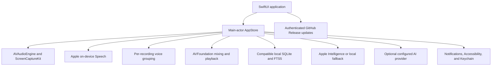
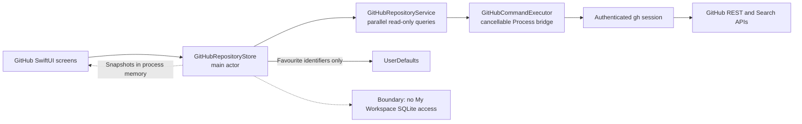
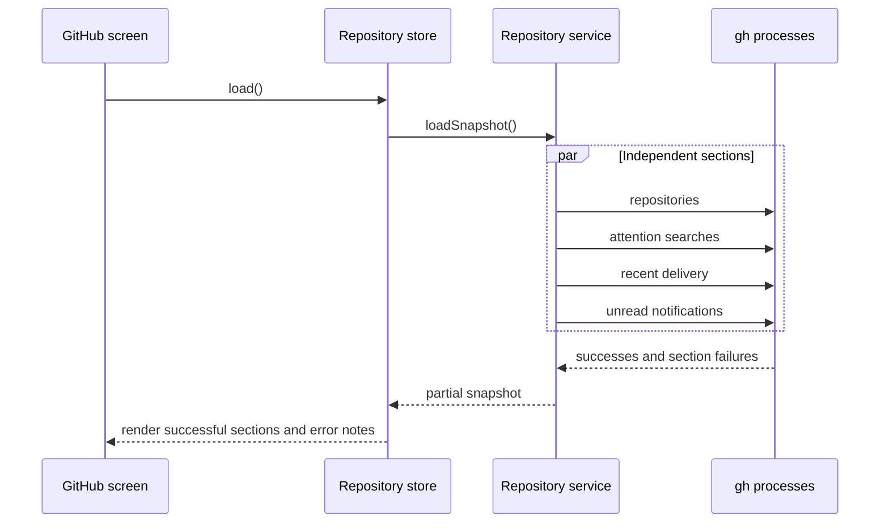

# System architecture

Atrium is a native macOS application built with Swift 6.1 and SwiftUI. The `Atrium` target owns scenes and views. The `AtriumCore` target owns local data, audio, transcription, retrieval, language services, and the private GitHub Release update contract. The application has no production Swift package dependencies.

## Components

### Application interface

SwiftUI provides the workspace window, Settings scene, menu-bar controls, onboarding, meetings, Ask, notes, summaries, playback, and Local Dictation. AppKit is used only for narrow macOS integration such as folders, the clipboard, and global keyboard events.

### Company Hub

The sidebar has a second section, `Company Hub`, with the Company, Agents, GitHub, Shared Context, People, Search, and Activity screens in `Sources/Atrium/Views/CompanyHub/`. This is the shared scope across Ubundi and First Motive. The workspace scope stays local and is unchanged.

The [product vision](product-vision.md) defines Company Hub as part of a private company intelligence workspace. Meetings can become shared company memory through an explicit owner action. People and agents can then use that approved context, while private workspace data stays on its owner's Mac. Sensitive personal content is local-only and must not enter Company Hub, Grounding, agent context, remote logs, analytics, or caches.

The screens are built. The shared workspace behind them is not. `CompanyHubStore` holds shared-workspace state and reads through the `CompanyHubProviding` protocol. The default `DisconnectedCompanyHubService` returns nothing for reads and `CompanyHubUnavailableError` for writes, so every screen shows an empty state that explains it, and `Share to hub`, agent messaging, and `Mark all read` stay disabled. No Company Hub screen reads or writes the local database. The GitHub screen is a direct connected-system view: `GitHubRepositoryStore` reads current repository, pull request, issue, notification, release, and workflow metadata through the authenticated `gh` CLI session. Dashboard snapshots stay in process memory, and `gh` can cache repository-detail responses for five minutes. `GitHubCommandExecutor` bridges `Process` to Swift concurrency and terminates the command on task cancellation. Independent dashboard reads can fail without removing successful sections. The store refreshes stale data when Atrium becomes active and stores only personal favourite repository identifiers in local preferences. It does not use the disconnected shared provider or send My Workspace content.

To implement the Company Hub, provide a `CompanyHubProviding` conformance and pass it to `CompanyHubStore` in `ContentView`. The shared scope also needs an authenticated backend and persistent shared database for accounts, memberships, shared items, agent threads and runs, permissions, activity, and unread state. The local SQLite database remains the private workspace store and must not become the shared database. The [product vision](product-vision.md#functionality-still-to-implement) lists the implementation gaps and proposed system responsibilities.

An implementation that moves meeting content off this Mac needs accepted architecture decisions for the backend, shared database, identity, authorization, local sensitive-content enforcement, synchronization, retention, and deletion because it crosses the local-first boundary. The share pipeline must preview and filter content on the Mac before its first network write, then fail closed when it cannot produce an approved shared payload.

The future direction includes a connection to the installation-owned Grounding company knowledge system through MCP. Each user must connect with their own Grounding account, and Grounding must enforce that user's access, citations, and query audit. Grounding's MCP service and the Atrium connection do not exist yet. Their authentication, principal mapping, token lifecycle, agent identity, and publishing boundaries need an accepted architecture decision before implementation.

### Audio and transcription

`AVAudioEngine` records the selected microphone. `ScreenCaptureKit` records system audio after macOS grants access. Atrium reads Screen Recording access before it starts a recording, because a locally built copy loses that grant whenever its signature changes; without access the recording stops and offers the two ways forward instead of silently capturing this Mac alone. `AVFoundation` creates the playback file and plays saved or imported audio. Imported audio is copied to a meeting folder before transcription. Import cancellation removes the partial copy and database record but never changes the source file.

Transcription is on-device and holds no length limit. On macOS 26 and later, `SpeechAnalyzer` with the `SpeechTranscriber` module reads live capture and whole saved recordings, and it needs no Speech Recognition consent. Before macOS 26, `SpeechFileTranscription` recognizes a saved recording in overlapping 45-second windows and places the result back on the recording timeline, because one `SFSpeechRecognizer` request over a long file fails part of the way through.

Recognized speech is saved while transcription runs: the live transcript is written before mixing can fail, and the file transcript is written at most every 10 seconds. A failure keeps what was already saved, names its cause in the banner, and leaves the audio on the Mac. Retranscription of a meeting that already holds a transcript writes nothing until it succeeds. See [ADR-011](decisions/011-transcribe-long-recordings-with-speechanalyzer.md).

Voice grouping uses acoustic features from the current recording. It creates anonymous labels such as `Speaker 1`, keeps no identity profile, and does not compare people across meetings. User-entered aliases apply only to one meeting.

### Local data

Atrium uses the SQLite database below `~/Library/Application Support/Notive/`. The native code reads and writes compatible meetings, transcripts, notes, summaries, speaker aliases, and FTS5 search tables. On user confirmation, it can add non-duplicate meetings and available recordings from the earlier `~/Library/Application Support/com.ubundi.meet/` location without changing the earlier copy. See [ADR-006](decisions/006-use-branded-application-support-directory.md).

Recording files use `~/Movies/notive-recordings/` by default. The user can select another local folder. Disabling saved audio removes only files created by the recorder after transcription completes. Imported source copies remain available for playback and retranscription.

### Ask and summaries

Ask retrieves a bounded set of local FTS5 evidence and nearby transcript context. Each generated claim must cite retrieved evidence. Apple Intelligence runs on device when it is available. A deterministic extractive implementation is the local fallback.

Ollama on a loopback address stays local. OpenAI, Anthropic, Groq, OpenRouter, remote Ollama, and custom OpenAI-compatible endpoints are external. API keys are stored in Keychain. Before the first external Ask request in an app session, Atrium identifies the provider and requires confirmation before it sends the question and selected evidence.

### Updates and distribution

Swift Package Manager builds the native application. A maintainer runs `scripts/release.sh` to update the version, commit and push it, create the Apple Silicon DMGs, and publish the private GitHub Release and tag. Installed applications use an authenticated GitHub CLI session to find and download the newest release. The updater stages and verifies the ad-hoc code-signed application before it replaces the running Atrium or legacy Notive installation, and it restores the prior copy when installation fails.

The internal distribution model is not Developer ID signed or notarized. macOS can show a Gatekeeper warning on first installation. GitHub authentication restricts access to the release but does not provide a separate application-update signature.

## Codemap

| Concern | Location | Owns |
| --- | --- | --- |
| Scenes, commands, menu bar | `Sources/Atrium/App/AtriumApp.swift` | Scene declaration and the lifetime of `AppStore` and `UpdaterService` |
| Screens | `Sources/Atrium/Views/` | Rendering and semantic user actions. See [FRONTEND.md](../FRONTEND.md) |
| macOS integration | `Sources/Atrium/Support/` | Global shortcut, application icon, version, update service |
| Workspace state | `Sources/AtriumCore/Stores/AppStore.swift` | The single source of truth for My Workspace |
| Company Hub state | `Sources/AtriumCore/Stores/CompanyHubStore.swift`, `GitHubRepositoryStore.swift` | Shared-scope state, current GitHub work, and local favourite identifiers |
| Domain types | `Sources/AtriumCore/Models/` | `Meeting`, `Ask`, `Recording`, `WorkspaceSelection`, `CompanyHub`, `AIConfiguration` |
| Capture and speech | `Sources/AtriumCore/Services/Audio*`, `*Capture*`, `Speech*`, `LiveSpeechTranscription.swift`, `ScreenRecordingAuthorization.swift`, `VoiceClusterService` | Recording, import, mixing, playback, transcription engines, capture permissions, voice grouping |
| Local storage and retrieval | `Sources/AtriumCore/Services/SQLiteDatabase.swift` | Schema, migrations, FTS5 search, Ask evidence, database paths |
| Language services | `Sources/AtriumCore/Services/LanguageProviderService.swift`, `LocalIntelligenceService.swift` | Provider selection, the external boundary, the local fallback |
| GitHub | `Sources/AtriumCore/Services/GitHubReleaseUpdater.swift`, `GitHubIdentityService.swift`, `GitHubRepositoryService.swift` | Release checks, download, install, identity, and company repository reads through the GitHub CLI |
| Diagnostics | `Sources/AtriumCore/Support/DiagnosticLogger.swift` | The `com.ubundi.meet` log subsystem |
| Build, package, release | `script/`, `scripts/` | Development builds, disk images, the release path |

## Important runtime flows

**Start.** `AtriumApp.init()` creates `AppStore`, which opens the database below `~/Library/Application Support/Notive/`, runs its migrations, and surveys the earlier `com.ubundi.meet` location for importable meetings. A failed open shows a recovery screen instead of the workspace. `ContentView` then calls `store.start()` to load meetings, and `UpdaterService` runs the automatic release check when the preference allows it.

**Capture a meeting.** `startRecording()` requires Microphone access, and Screen Recording access when system audio is on; a missing Screen Recording grant stops the start and offers Screen Recording settings or a microphone-only recording. `AVAudioEngine` and `ScreenCaptureKit` write the source audio while the speech analyzer returns live segments. `stopRecording()` saves the live transcript, mixes the playback file, then transcribes the saved audio in parts and runs voice grouping before it writes the complete transcript. Cancellation removes the partial records. A failure with no recognized speech sets `recordingState` to `.failed`; a failure after some speech keeps that transcript, stays in `.idle`, and asks the user to transcribe again.

**Send evidence outside the Mac.** Ask retrieves bounded FTS5 evidence locally. When the selected provider is external, `askPhase` becomes `.confirming` and the request stops. Nothing leaves the Mac until `confirmExternalAsk()` approves that `ExternalAskDestination` for the session. The local fallback needs no confirmation.

**Install an update.** `UpdaterService` compares the newest tag from `gh release view` with the bundle version, downloads the versioned disk image for the running Atrium or legacy Notive bundle path, mounts it, verifies the ad-hoc signature, replaces that installation, and relaunches. A failed install restores the prior application. An active recording, transcription, dictation, or import blocks installation.

## Invariants and verification

| Invariant | Why | Proof |
| --- | --- | --- |
| Ask evidence stays local, scoped, and bounded, and it ignores instructions inside a question | Retrieval is the trust boundary that citations depend on | `SQLiteDatabaseTests` |
| An external Ask request sends only the reviewed question and destination | Meeting evidence leaves the Mac by explicit consent | `SQLiteDatabaseTests` |
| A disconnected Company Hub reads nothing and reports why a write failed | Every hub screen must explain its empty state, and nothing may publish silently | `CompanyHubTests` |
| Transcription of any recording length saves its progress, and a failure keeps the recognized speech and the audio | A meeting must never end with no record of what was said | `TranscriptionResilienceTests` |
| A meeting that already holds a transcript keeps it until a new run succeeds | A retry must not replace a complete transcript with a shorter one | `TranscriptionResilienceTests` |
| Import from the earlier installation adds only what is missing and never changes the source | A restore must not damage or duplicate existing meeting data | `PreviousInstallationTests` |
| Deleting a meeting cascades through its local records | Evidence must not outlive the meeting a user removed | `SQLiteDatabaseTests` |
| Only a newer stable release is offered, and active work blocks installation | An update must not interrupt a recording, transcription, dictation, or import | `GitHubReleaseUpdaterTests`, `UpdaterServiceTests` |
| The updater replaces the running Atrium or legacy Notive installation only after it verifies the staged bundle, and it restores the prior application on failure | An interrupted update must leave a working installation | Manual check in [RELEASING.md](RELEASING.md) |

The `Atrium` target depends on `AtriumCore`, and no dependency runs the other way. `macos/Package.swift` enforces it. Run the checks in [AGENTS.md](../AGENTS.md) for a change that touches any row above.

## Repository boundary

The repository contains only the supported native macOS application and its build, test, and release tools. The former Tauri, Rust, and Python implementations were retired after the native cutover. Git history keeps them for reference.
