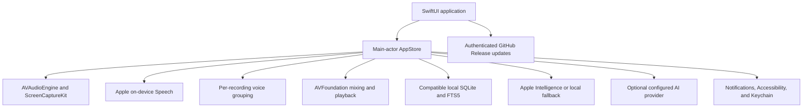

# System architecture

Notive is a native macOS application built with Swift 6.1 and SwiftUI. The `Notive` target owns scenes and views. The `NotiveCore` target owns local data, audio, transcription, retrieval, language services, and the private GitHub Release update contract. The application has no production Swift package dependencies.

## Components

### Application interface

SwiftUI provides the workspace window, Settings scene, menu-bar controls, onboarding, meetings, Ask, notes, summaries, playback, and Local Dictation. AppKit is used only for narrow macOS integration such as folders, the clipboard, and global keyboard events.

### Company Hub

The sidebar has a second section, `Company Hub`, with the Company, Agents, Shared Context, People, Search, and Activity screens in `Sources/Notive/Views/CompanyHub/`. This is the shared scope across Ubundi and First Motive. The workspace scope stays local and is unchanged.

The [product vision](product-vision.md) defines Company Hub as part of a private company intelligence workspace. Meetings can become shared company memory through an explicit owner action. People and agents can then use that approved context, while private workspace data stays on its owner's Mac. Sensitive personal content is local-only and must not enter Company Hub, Grounding, agent context, remote logs, analytics, or caches.

The screens are built. The shared workspace behind them is not. `CompanyHubStore` holds their state and reads through the `CompanyHubProviding` protocol. The default `DisconnectedCompanyHubService` returns nothing for reads and `CompanyHubUnavailableError` for writes, so every screen shows an empty state that explains it, and `Share to hub`, agent messaging, and `Mark all read` stay disabled. No Company Hub screen reads or writes the local database, and nothing leaves the Mac.

To implement the Company Hub, provide a `CompanyHubProviding` conformance and pass it to `CompanyHubStore` in `ContentView`. The shared scope also needs an authenticated backend and persistent shared database for accounts, memberships, shared items, agent threads and runs, permissions, activity, and unread state. The local SQLite database remains the private workspace store and must not become the shared database. The [product vision](product-vision.md#functionality-still-to-implement) lists the implementation gaps and proposed system responsibilities.

An implementation that moves meeting content off this Mac needs accepted architecture decisions for the backend, shared database, identity, authorization, local sensitive-content enforcement, synchronization, retention, and deletion because it crosses the local-first boundary. The share pipeline must preview and filter content on the Mac before its first network write, then fail closed when it cannot produce an approved shared payload.

The future direction includes a connection to the installation-owned Grounding company knowledge system through MCP. Each user must connect with their own Grounding account, and Grounding must enforce that user's access, citations, and query audit. Grounding's MCP service and the Notive connection do not exist yet. Their authentication, principal mapping, token lifecycle, agent identity, and publishing boundaries need an accepted architecture decision before implementation.

### Audio and transcription

`AVAudioEngine` records the selected microphone. `ScreenCaptureKit` records system audio after macOS grants access. `AVFoundation` creates the playback file and plays saved or imported audio. Apple Speech performs on-device live and final transcription. Imported audio is copied to a meeting folder before transcription. Import cancellation removes the partial copy and database record but never changes the source file.

Voice grouping uses acoustic features from the current recording. It creates anonymous labels such as `Speaker 1`, keeps no identity profile, and does not compare people across meetings. User-entered aliases apply only to one meeting.

### Local data

Notive uses the SQLite database below `~/Library/Application Support/Notive/`. The native code reads and writes compatible meetings, transcripts, notes, summaries, speaker aliases, and FTS5 search tables. On user confirmation, it can add non-duplicate meetings and available recordings from the earlier `~/Library/Application Support/com.ubundi.meet/` location without changing the earlier copy. See [ADR-006](decisions/006-use-branded-application-support-directory.md).

Recording files use `~/Movies/notive-recordings/` by default. The user can select another local folder. Disabling saved audio removes only files created by the recorder after transcription completes. Imported source copies remain available for playback and retranscription.

### Ask and summaries

Ask retrieves a bounded set of local FTS5 evidence and nearby transcript context. Each generated claim must cite retrieved evidence. Apple Intelligence runs on device when it is available. A deterministic extractive implementation is the local fallback.

Ollama on a loopback address stays local. OpenAI, Anthropic, Groq, OpenRouter, remote Ollama, and custom OpenAI-compatible endpoints are external. API keys are stored in Keychain. Before the first external Ask request in an app session, Notive identifies the provider and requires confirmation before it sends the question and selected evidence.

### Updates and distribution

Swift Package Manager builds the native application. A maintainer runs `scripts/release.sh` to update the version, commit and push it, create the Apple Silicon DMGs, and publish the private GitHub Release and tag. Installed applications use an authenticated GitHub CLI session to find and download the newest release. The updater stages and verifies the ad-hoc code-signed application before it replaces `/Applications/Notive.app`, and it restores the prior copy when installation fails.

The internal distribution model is not Developer ID signed or notarized. macOS can show a Gatekeeper warning on first installation. GitHub authentication restricts access to the release but does not provide a separate application-update signature.

## Codemap

| Concern | Location | Owns |
| --- | --- | --- |
| Scenes, commands, menu bar | `Sources/Notive/App/NotiveApp.swift` | Scene declaration and the lifetime of `AppStore` and `UpdaterService` |
| Screens | `Sources/Notive/Views/` | Rendering and semantic user actions. See [FRONTEND.md](../FRONTEND.md) |
| macOS integration | `Sources/Notive/Support/` | Global shortcut, application icon, version, update service |
| Workspace state | `Sources/NotiveCore/Stores/AppStore.swift` | The single source of truth for My Workspace |
| Company Hub state | `Sources/NotiveCore/Stores/CompanyHubStore.swift` | Shared-scope state read through `CompanyHubProviding` |
| Domain types | `Sources/NotiveCore/Models/` | `Meeting`, `Ask`, `Recording`, `WorkspaceSelection`, `CompanyHub`, `AIConfiguration` |
| Capture and speech | `Sources/NotiveCore/Services/Audio*`, `*Capture*`, `Speech*`, `VoiceClusterService` | Recording, import, mixing, playback, transcription, voice grouping |
| Local storage and retrieval | `Sources/NotiveCore/Services/SQLiteDatabase.swift` | Schema, migrations, FTS5 search, Ask evidence, database paths |
| Language services | `Sources/NotiveCore/Services/LanguageProviderService.swift`, `LocalIntelligenceService.swift` | Provider selection, the external boundary, the local fallback |
| Updates and identity | `Sources/NotiveCore/Services/GitHubReleaseUpdater.swift`, `GitHubIdentityService.swift` | Release checks, download, install, GitHub session |
| Diagnostics | `Sources/NotiveCore/Support/DiagnosticLogger.swift` | The `com.ubundi.meet` log subsystem |
| Build, package, release | `script/`, `scripts/` | Development builds, disk images, the release path |

## Important runtime flows

**Start.** `NotiveApp.init()` creates `AppStore`, which opens the database below `~/Library/Application Support/Notive/`, runs its migrations, and surveys the earlier `com.ubundi.meet` location for importable meetings. A failed open shows a recovery screen instead of the workspace. `ContentView` then calls `store.start()` to load meetings, and `UpdaterService` runs the automatic release check when the preference allows it.

**Capture a meeting.** `startRecording()` requests Microphone access, and Screen Recording access when system audio is on. `AVAudioEngine` and `ScreenCaptureKit` write the source audio while Apple Speech returns live segments. `stopRecording()` mixes the playback file, runs final transcription and voice grouping, and writes the meeting, transcripts, and aliases to SQLite. Cancellation removes the partial records. Failures set `recordingState` to `.failed` and report through the error banner.

**Send evidence outside the Mac.** Ask retrieves bounded FTS5 evidence locally. When the selected provider is external, `askPhase` becomes `.confirming` and the request stops. Nothing leaves the Mac until `confirmExternalAsk()` approves that `ExternalAskDestination` for the session. The local fallback needs no confirmation.

**Install an update.** `UpdaterService` compares the newest tag from `gh release view` with the bundle version, downloads the versioned disk image, mounts it, verifies the ad-hoc signature, replaces `/Applications/Notive.app`, and relaunches. A failed install restores the prior application. An active recording, transcription, dictation, or import blocks installation.

## Invariants and verification

| Invariant | Why | Proof |
| --- | --- | --- |
| Ask evidence stays local, scoped, and bounded, and it ignores instructions inside a question | Retrieval is the trust boundary that citations depend on | `SQLiteDatabaseTests` |
| An external Ask request sends only the reviewed question and destination | Meeting evidence leaves the Mac by explicit consent | `SQLiteDatabaseTests` |
| A disconnected Company Hub reads nothing and reports why a write failed | Every hub screen must explain its empty state, and nothing may publish silently | `CompanyHubTests` |
| Import from the earlier installation adds only what is missing and never changes the source | A restore must not damage or duplicate existing meeting data | `PreviousInstallationTests` |
| Deleting a meeting cascades through its local records | Evidence must not outlive the meeting a user removed | `SQLiteDatabaseTests` |
| Only a newer stable release is offered, and active work blocks installation | An update must not interrupt a recording, transcription, dictation, or import | `GitHubReleaseUpdaterTests`, `UpdaterServiceTests` |
| The updater replaces `/Applications/Notive.app` only after it verifies the staged bundle, and it restores the prior application on failure | An interrupted update must leave a working installation | Manual check in [RELEASING.md](RELEASING.md) |

The `Notive` target depends on `NotiveCore`, and no dependency runs the other way. `macos/Package.swift` enforces it. Run the checks in [AGENTS.md](../AGENTS.md) for a change that touches any row above.

## Repository boundary

The repository contains only the supported native macOS application and its build, test, and release tools. The former Tauri, Rust, and Python implementations were retired after the native cutover. Git history keeps them for reference.
