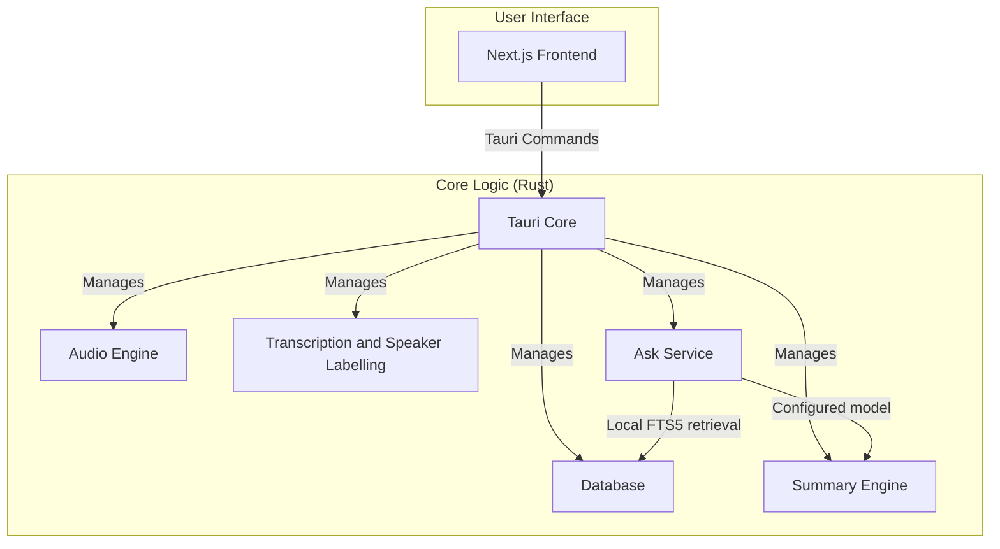

# System Architecture

Ubundi Meet is a self-contained desktop application built with [Tauri](https://tauri.app/). It combines a Rust-based backend with a Next.js frontend into a single, efficient, and cross-platform application.

## High-Level Architecture Diagram

## Component Details

### Frontend (Next.js)

*   Provides the user interface for managing meetings, displaying transcriptions, and configuring the application.
*   Communicates with the Rust core through Tauri's command system.

### Backend (Rust Core)

*   **Tauri Core:** The heart of the application, responsible for managing the window, handling events, and exposing the Rust core to the frontend.
*   **Audio Engine:** Captures audio from the microphone and system, processes it, and prepares it for transcription.
*   **Transcription and Speaker Labelling:** Uses local speech-to-text models (Whisper or Parakeet) to transcribe captured audio. During a recording, a local speaker-embedding model groups speech segments by voice and adds anonymous labels such as `Speaker 1`. The app stores these labels in the transcript. It keeps per-recording voice profiles and embeddings in memory and discards them when recording stops. It does not infer identity or match voices across meetings. Transcription can use GPU acceleration.
*   **Database:** A local SQLite database stores meeting metadata, transcripts, summaries, the transcript search index, and meeting-scoped speaker aliases. An alias maps a user-entered name to an original diarization label without changing the source transcript row. Deleting a meeting also deletes its aliases.
*   **Resolved Transcript Names:** The frontend resolves an alias for saved transcript display and copied text while it retains the original label as context. The same resolution is used for the next explicit summary generation or regeneration. An alias change does not change an existing summary.
*   **Summary Engine:** Generates meeting summaries with different Large Language Models (LLMs), including local models through Ollama. The selected model receives user-confirmed speaker aliases in the resolved transcript input.
*   **Ask Service:** Separates deterministic local evidence retrieval from answer generation. A bounded SQLite FTS5 query ranks transcript segments and adds nearby context. The model receives labelled evidence as untrusted data and must return structured claims with valid source IDs. Rust rejects malformed citations and claims without retrieved evidence.

## Ask data boundary

The Ask surface uses all saved meetings by default. A user can restrict retrieval by meeting and date. Retrieval, ranking, neighbor selection, citation construction, and citation navigation run in the Rust core against local SQLite data. Results are bounded before prompt construction.

Built-in AI and Ollama on a loopback address use the existing model path without an additional Ask warning. Remote Ollama endpoints and other configured providers are external. Before the first external Ask request in an app session, the interface identifies the provider and requires confirmation that it can receive the question and the selected transcript evidence. The Rust command also rejects an unconfirmed external request.

The model returns JSON claims and citation IDs. Each ID must refer to retrieved evidence. The frontend renders the validated citation next to its claim. A citation opens `/meeting-details` with the meeting ID, transcript ID, and recording-relative timestamp so the transcript can load, scroll to, and highlight the exact segment.
