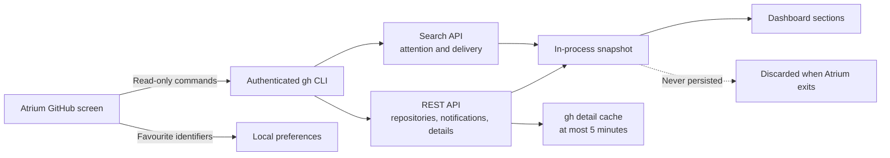
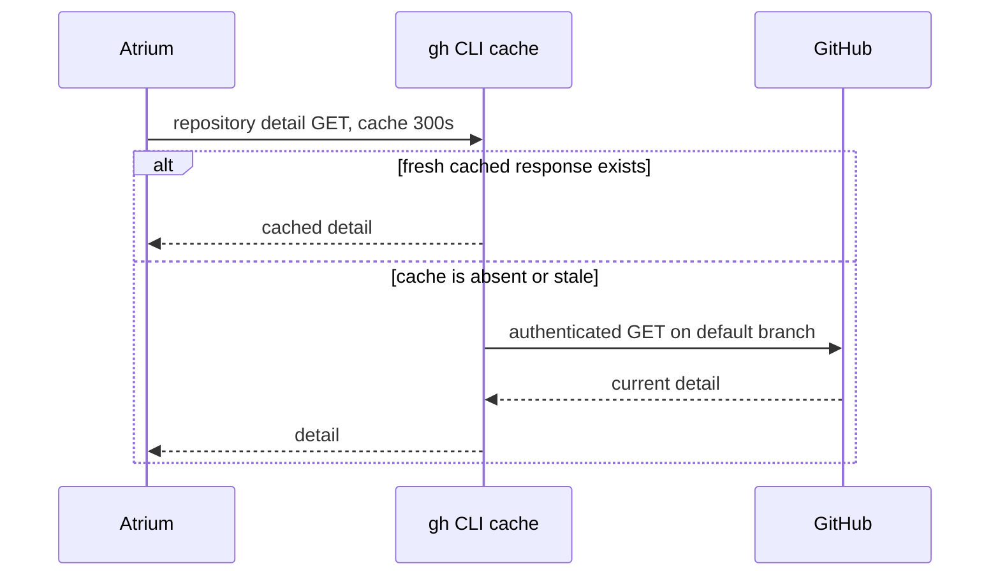

# ADR-010: Read company repositories through the authenticated GitHub CLI

## Status

Accepted

## Date

2026-08-16

## Context

Atrium needs a useful GitHub view for repositories in the Ubundi and First Motive organizations. Onboarding already verifies the installed GitHub CLI, its authenticated user, and membership in a company organization. Adding another token or a Company Hub backend proxy would duplicate that identity path and create new credential storage.

Repository, pull request, issue, release, and workflow metadata is current operational data from a specialist company system. Atrium needs to present it and link back to GitHub, not become its source of truth.

## Decision

Read repositories, pull requests, issues, notifications, releases, and workflow runs directly from the GitHub API through the authenticated `gh` CLI session. Query Ubundi and First Motive and merge the results on the Mac. Keep dashboard snapshots in process memory. Permit the GitHub CLI to cache repository-detail API responses for at most five minutes; Atrium owns no persistent GitHub-content store.

Show only data that the signed-in GitHub user can access. Include the user's unread notifications as a read-only inbox. Keep repository and notification actions in GitHub by opening the source URL. Store personal favourite repository identifiers in local preferences, but do not copy GitHub content into the private workspace database or the disconnected Company Hub provider.

Run dashboard sections independently. A failed search or API call must leave successful sections visible with a local error note. Cache repository-detail API reads in `gh` for five minutes, matching the application refresh interval. Scope repository workflow health to its default branch.

## Alternatives considered

### Add a second GitHub token to Atrium

This duplicates authentication and requires new Keychain, renewal, revocation, and settings behavior without adding user value.

### Proxy GitHub through a Company Hub backend

No Company Hub backend exists. A proxy would also need an accepted shared identity and authorization design before it could preserve each user's GitHub access.

### Ingest repositories into local SQLite

Persistent metadata would become stale and would mix company-system state into the private meeting database.

## Consequences

- The GitHub screen works only while `gh` remains installed, authenticated, and authorized for the organizations.
- GitHub remains the source of truth for repository visibility, notifications, and detail.
- Atrium stores no dashboard snapshot after it exits. The GitHub CLI can retain repository-detail responses for up to five minutes in its own cache. Atrium refreshes stale or partial data when it becomes active.
- A single failed query produces a section error instead of blanking the dashboard.
- Notification actions remain in GitHub; marking notifications as read would need a separate write decision.
- The async command bridge terminates `gh` when its Swift task is cancelled.
- Favourite repository identifiers persist in local preferences and are not shared.
- The screen can work before the shared Company Hub backend exists without weakening the My Workspace boundary.
- Future GitHub write actions need a separate decision and explicit user confirmation.
