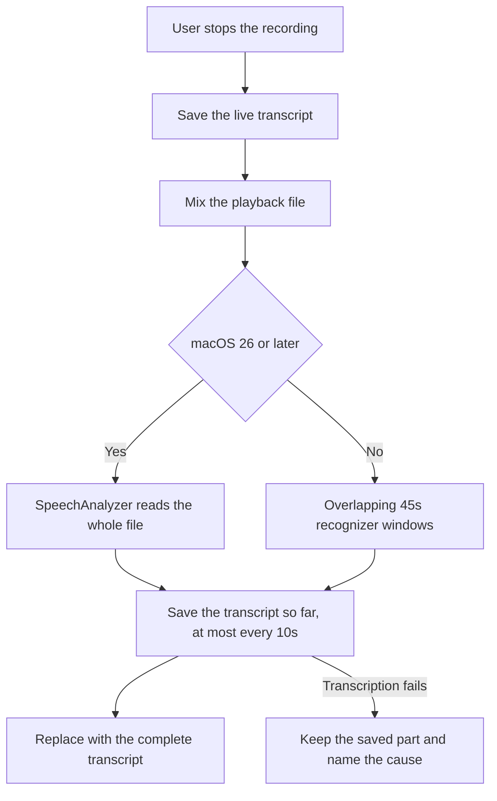

# ADR-011: Transcribe long recordings with SpeechAnalyzer and save the transcript in parts

## Status

Accepted

## Date

2026-08-17

## Context

Atrium transcribed a finished meeting with one `SFSpeechURLRecognitionRequest` over the whole file. That interface is built for short audio. A 50-minute meeting recorded on 2026-08-17 held the recognizer for 2 minutes 49 seconds and then failed, and the meeting was left with no transcript at all. The failure path also reported one generic sentence and logged the cause as private data, so the reason could not be read afterwards.

The live transcript had the same limit. `SFSpeechAudioBufferRecognitionRequest` stops after about one minute of audio, its error was discarded, and the recognized speech was held only in memory. `stopRecording()` then discarded it and recognized the file again from the start, so one failure at the end lost the whole meeting.

macOS 26 provides `SpeechAnalyzer` with the `SpeechTranscriber` module, which is built for long-form audio, returns finalized results while it reads, needs no Speech Recognition consent, and runs on the Apple Neural Engine. It is unavailable before macOS 26, and Atrium supports macOS 14.

## Decision

Transcribe saved recordings through `SpeechAnalyzer` and `SpeechTranscriber` on macOS 26 and later. Use the same interface for the live transcript of a recording in progress.

Before macOS 26, transcribe a saved recording in overlapping `SFSpeechRecognizer` windows of 45 seconds with 2 seconds of shared audio. Place each window's timing back on the recording timeline, give the speech in a seam to one window only, and keep the windows that succeeded when one window fails.

Save the transcript in parts while transcription runs. Recognized speech is written to SQLite at most every 10 seconds, the live transcript is written before mixing or file transcription can fail, and a failure keeps what was already saved. A meeting that already holds a transcript keeps it until a new run succeeds.

Name the cause in the interface and in the log. A failure that Atrium wrote a sentence for adds that sentence to the banner, and `DiagnosticLogger` records a public `code` beside the private cause.

## Alternatives considered

### Keep one request over the whole file

This is the behavior that lost the meeting. The interface is documented for short audio and gives no result before it fails.

### Chunk on every macOS version

Windows lose the acoustic context across a seam and need one request for each window. `SpeechAnalyzer` reads a whole recording in one pass, so chunking is the fallback rather than the default.

### Keep only the live transcript

Live recognition is optimized for immediacy, not accuracy, and it stops when the user pauses. The saved file remains the evidence a transcript must come from.

### Show the raw framework error in the banner

A framework message is not written for the person using Atrium. The banner shows the sentence Atrium wrote for that failure, and the log carries the framework detail.

## Consequences

- A meeting of any length is transcribed, and progress survives a failure part of the way through.
- macOS 26 file transcription needs no Speech Recognition consent. Live capture before macOS 26 still needs it.
- The speech model for the selected language is installed on demand through `AssetInventory`, which needs the network the first time for a language that is not present.
- Transcription writes to SQLite while it runs, so the meeting screen fills in as the work continues.
- Retranscription of a meeting that already holds a transcript makes no partial write, so a failed retry cannot replace a complete transcript with a shorter one.
- The Mac keeps every recognition step. Nothing about this decision sends audio or text off the Mac.
- `SpeechTranscriptionError` gained `modelUnavailable`, and `SystemAudioCaptureError` gained `accessDenied`. Both carry a diagnostic code.
