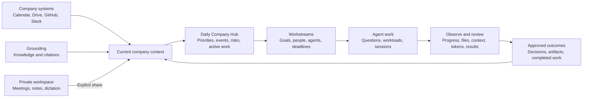
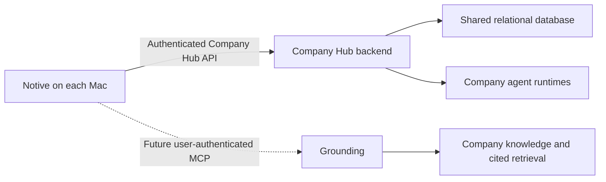

# Product vision

Notive is the private, daily operating hub for Ubundi and First Motive. It connects people, company agents, company knowledge, work, and company systems in one internal macOS application.

Notive is moving beyond its origin as a meeting, transcription, notes, recording, and dictation application. Those capabilities remain useful inputs, but they do not define the product. The main experience is a complete internal workspace that employees open at the start of the day and use to understand the company, communicate with agents, direct work, and review results.

Each person also has a private workspace on their Mac. The person chooses which meetings, notes, and other work become part of the shared Company Hub. People and agents can then work from the same approved company context without weakening the local privacy boundary.

> Start with company context. Work with agents. See the work and its results. Keep private work private.

This document describes the product direction. It does not approve a shared-service architecture or change the local-first boundaries in [System architecture](architecture.md).

## Product promise

Notive gives the company one trusted place to:

- see the company context, events, deadlines, and work that need attention;
- communicate with internal company agents and direct workloads;
- follow agent sessions, resource use, progress, results, and failures;
- browse agent workspaces, files, outputs, and approved memory;
- find and use shared company knowledge through Grounding;
- connect relevant company systems, including Google Workspace;
- capture conversations and decisions when needed; and
- find knowledge across private and shared scopes without exposing private work.

Notive is more than a meeting assistant, intranet, chat tool, agent dashboard, or collection of company links. It is the internal operating workspace where people start their day, understand current company context, work with agents, and move company work forward. Its first purpose is to make Ubundi and First Motive more effective. First Motive is the current main venture and the primary proving ground for the product.

The long-term product category is a **company intelligence workspace**. A **company intelligence operating system** describes the larger ambition, but it must not imply that Notive replaces every specialist company system.

## Two explicit scopes

Notive has two scopes. The interface and service boundaries must keep them clear.

### My Workspace

My Workspace is private and local. It includes meeting capture, transcription, notes, summaries, Dictation, Ask, and local search. This data stays on the person's Mac unless the owner takes an explicit share action.

### Company Hub

Company Hub is the shared, daily home for company work. It contains only company-visible information. It brings together company agents, their work and results, approved company knowledge, people, events, deadlines, connected company systems, search, and activity. It also includes items that owners chose to share from My Workspace.

Nothing crosses from My Workspace to Company Hub by default. Sharing is a per-item choice. The owner must be able to see the sharing state and withdraw a shared item.

## Highest-priority privacy invariant

**Sensitive personal content stays on the person's Mac.** This is a product invariant and a release requirement, not an optional setting or later hardening task. A shared backend, Grounding connection, or company agent must not weaken it.

Local-only content includes:

- private meetings, notes, dictation, drafts, and search history that the owner did not share;
- meeting recordings and the acoustic features used for local voice grouping;
- credentials, authentication tokens, and recovery information;
- private contact details and personal profile information that the company workspace does not need;
- health, financial, identity, family, and other personal-life information;
- private employment information such as compensation, performance, disciplinary, or wellbeing records; and
- any content that the owner marks as private or that company policy excludes from shared systems.

The shared company scope can contain the minimum work identity needed for collaboration, such as a person's name, company, role, and stated work focus. It must not become a general employee profile or personnel system.

Before Notive shares meeting or note text, it must:

1. show the exact content and destination to the owner;
2. detect and remove likely sensitive personal content on the Mac;
3. let the owner edit or cancel the share;
4. send only the approved text and minimum metadata; and
5. record what was shared without copying the private source into the shared database.

Local detection is a safeguard, not proof that content is safe. Owner review remains required. Notive must not send private content to an external service to decide whether that content is private.

Sensitive personal content must also stay out of analytics, crash reports, logs, notifications, agent prompts, agent output, search indexes, embeddings, caches, and backups outside the Mac. Automated agents must use the same boundary as the interface and must not share local context on a user's behalf.

If Notive cannot prove that a write stays within the approved shared content, it must fail closed and keep the content local.

## The company operating loop

The central product loop is:

```text
Company context -> human direction -> agent work -> observable execution -> useful outcomes -> shared knowledge
```

1. An employee opens Notive and sees current company context, priorities, events, deadlines, and activity.
2. The employee finds trusted knowledge or communicates with a company agent.
3. The employee gives the agent a question, task, or workload with clear authority.
4. Notive shows the agent's session, progress, resource use, files, memory use, output, and failures at the level that the employee is allowed to see.
5. The employee reviews the result and takes the next action or approves an external action.
6. Approved results, decisions, and source material strengthen shared company knowledge and future work.



Meetings, notes, recordings, transcription, and dictation support this loop. They can capture useful source material, but they are not the center of the product.

This loop must preserve provenance. A shared fact, answer, or agent output should remain connected to its source where possible.

## The daily experience

Notive should be useful from the start to the end of an employee's day.

At the start of the day, Notive gives the employee a short, role-aware briefing. It can include:

- today's meetings, deadlines, and important work;
- material changes since the employee last opened Notive;
- active First Motive workstreams and current blockers;
- agent work that completed, failed, or needs approval;
- recent decisions that affect the employee; and
- a small set of suggested next actions.

The briefing must be selective and cited. It must not become another notification feed. Each item should lead to a useful action, such as opening its source, asking an agent, continuing a workstream, reviewing a result, resolving a blocker, or approving an external action.

During the day, the employee uses Notive to find context, communicate with people and agents, direct workloads, follow execution, and review durable results. At the end of the day, Notive can show what changed, what was completed, what remains blocked, which agents are still working, and what needs attention next.

## Workstreams are the main unit of company work

A chat thread is useful for conversation, but it is too narrow and temporary to organize company work. Notive should organize persistent company work around a **workstream**.

A workstream represents a goal, project, problem, opportunity, or recurring company process. It connects:

- the intended outcome and current status;
- owners, participants, and responsible agents;
- relevant Grounding knowledge and other source context;
- conversations, workloads, and agent sessions;
- workspace files and durable results;
- decisions, open questions, and approvals;
- events, dependencies, and deadlines; and
- the next useful actions.

Examples include First Motive customer discovery, preparation for a weekly venture review, evaluation of a robotics platform, recruitment, a client proposal, and an investigation into a production problem.

Agent conversations and runs should remain attached to the workstream that gave them purpose. A result should not disappear into chat history after the conversation ends.

## Product areas

### Company

Company is the daily start page. It shows what matters now across Ubundi and First Motive: priorities, upcoming events, deadlines, recent decisions, active agent work, results, and open activity. It uses permitted context from Grounding and connected systems such as Google Calendar and Google Workspace. It must help an employee decide what to do next without becoming a general analytics dashboard.

### Workstreams

Workstreams are the operating view of current company work. Each workstream combines its outcome, people, agents, knowledge, files, decisions, deadlines, progress, and next actions. This is where an employee follows work from initial intent to a reviewed result.

### Agents

Agents are a central part of Notive and a visible part of the company workforce. Employees can discover agents, communicate with them, give them workloads, follow their sessions, and review their results. Each agent has a name, role, purpose, capabilities, owner, authority, status, company-visible threads, runs, and reviewable output.

Where access permits, an agent workspace exposes:

- current and previous sessions;
- progress, status, errors, and pending approvals;
- token and model use, timing, and other useful resource measures;
- workspace files and artifacts that the agent reads or produces;
- the agent's approved working memory and relevant source context; and
- results, citations, and actions that people can inspect and continue from.

Observability exists to understand, guide, debug, and trust agent work. It must not expose secrets, hidden reasoning, private user context, or information outside the viewer's access. An agent must not appear to have access or authority that it does not have.

### Shared Context

Shared Context is the company's working memory. Grounding is the primary knowledge and retrieval system behind this experience. Notive uses its future MCP connection to present permitted company knowledge as a native, cited experience instead of as a separate search tool. Shared Context also contains approved meetings, notes, briefs, and agent output. Every item shows its source, access scope, owner or contributor, and sharing time where applicable.

### Company systems

Notive brings useful company systems into the daily workflow. Google Calendar and other Google Workspace services are initial examples. The hub can show upcoming events, deadlines, documents, and other work signals when the connected system and the user's access permit it.

Notive does not need to replace these specialist systems. It gives their most useful context a coherent place beside agents, company knowledge, and current work. Each connection must preserve source identity, access rules, and a clear route to the source system.

### People

People shows the human and agent organisation. It helps the team understand roles, company membership, current focus, and availability. Agents remain clearly marked so the interface does not present them as people.

### Search

Search is one retrieval experience across the user's local workspace and the shared company scope. Results must show their source and scope. A local result can be shown to its owner without making that result visible to the company.

### Activity

Activity is a company-visible history of important actions and outputs. It shows who or what acted, what happened, when it happened, and relevant source detail. Agent session events and useful results appear here when they matter to the company. It supports awareness and review; it is not employee surveillance.

### Decisions and results

Important results must become durable company artifacts instead of transient messages. Employees can find, cite, review, update, compare, and reuse them. Each result remains connected to its workstream, agent or person, source context, review state, and creation time.

Notive should also maintain a reviewable decision ledger. A decision shows what was decided, who approved it, when it applies, its supporting evidence, the affected workstreams, and whether a later decision superseded it. Notive can propose decisions from meetings, documents, or agent results, but a person must confirm them before they become company records.

## People and agents use the same context with different authority

People and agents can use the same shared company memory, but they do not have the same identity or authority.

- A person acts through their own user account.
- An agent acting for a person must not retrieve more information than that person can access.
- A company agent with independent duties needs its own explicit identity, access policy, and audit history.
- A shared service credential must never bypass user or agent access rules.
- Agent output must identify the agent and the source context used to produce it.

## Future Grounding connection

Notive is expected to connect to **Grounding**, the company knowledge system in the `grounding_ai` repository. The current local working copy is at:

```text
/Users/matthew-schramm-ubundi/Workspace.nosync/Personal/grounding_ai
```

Grounding ingests company sources such as Slack, Google Drive, GitHub, Gmail, web pages, local documents, and meeting notes. It retrieves cited knowledge under per-user access control. In the combined product direction:

- Notive is the native personal and company operating workspace.
- Grounding is the installation-owned company knowledge and retrieval system.
- Notive connects to Grounding through the Model Context Protocol (MCP) when Grounding's MCP service is implemented and approved.
- Each Notive user connects with their own Grounding user account.
- Every MCP request carries an authenticated Grounding principal. Grounding remains responsible for access checks, citations, and query audit.
- Notive and its agents show only records that Grounding permits that principal to retrieve.
- Notive stores any local account secret or token in Keychain and does not write it to the Notive database, logs, or shared context.

The Grounding MCP service does not exist yet. Grounding tracks it as a deferred, approval-gated phase that depends on its access-control and audit requirements. Notive must not simulate the connection with broad API credentials or weaken either product's trust boundary.

Before implementation, an accepted architecture decision must define:

- the sign-in and account-linking flow;
- MCP transport and session authentication;
- how a Notive user maps to a Grounding principal;
- whether company agents use a user principal or a separate agent principal;
- token storage, renewal, revocation, and sign-out;
- query and agent-run audit behavior;
- citation and source rendering in Notive;
- offline, unavailable, and partial-result behavior; and
- the separate write path for sharing or withdrawing meeting content.

The MCP retrieval connection must not silently turn every local meeting into company knowledge. Publishing a meeting from Notive to the Company Hub or Grounding remains a separate, explicit owner action.

Questions sent to Grounding leave the Mac and become subject to Grounding's query audit. Notive must make this scope clear before submission. A question that contains sensitive personal content must stay in local Ask and must not be sent through MCP.

## Product principles

### Local by default

Capture, recordings, sensitive personal content, and private thinking stay on the Mac. A connected company service does not change the default scope.

### Share with intent

The owner chooses what enters the shared company scope. The product shows the choice before and after sharing.

### Access follows identity

Every shared read and write has an accountable person or agent identity. Access rules apply at retrieval time and fail closed.

### Sources stay visible

Search answers, shared knowledge, and agent output keep citations or source links where possible. Notive must help a person verify why an answer exists.

### Agents are observable

The team can see an agent's role, current state, sessions, resource use, company-visible conversation, workspace artifacts, approved memory, and output. Automation must not become invisible company activity.

### Useful every day

The Company Hub starts with current work. It shows the context, events, deadlines, agents, and results that help an employee act now. A connected feature belongs in the daily experience only when it reduces effort or improves a decision.

### Actions over dashboards

Notive must help people act, not only observe. A briefing item, answer, alert, or result should lead to a clear next action where one exists. The product should avoid passive panels that add information without reducing effort or improving a decision.

### Durable results over transient chat

Conversation supports work, but it is not the final product. Useful results, decisions, files, and evidence must remain available through their workstreams after a conversation or agent session ends.

### Activity is for coordination

Activity helps the team understand work and changes. It must not become passive monitoring of private work or personal behaviour.

## How Notive becomes more valuable over time

Notive creates a company value loop:

```text
Better context -> clearer direction -> better agent work -> reviewed outcomes -> stronger company knowledge -> better context
```

Each completed workstream can leave behind approved knowledge, decisions, reusable results, and a better operating pattern. Grounding makes that material available under the correct access rules. Future people and agents can then start with more relevant context and avoid repeating earlier work.

The loop depends on quality control. Notive must not add every message or unreviewed agent output to company memory. Shared outcomes need an owner, source, review state, access scope, and a way to be corrected, withdrawn, expired, or superseded.

The long-term advantage is not the chat interface or access to a specific model. It is the combination of company context, permission-aware knowledge, reusable workstreams, observable agents, durable results, and a trusted history of how the company gets work done.

### Repeatable company rhythms

Notive should turn recurring company processes into reviewable, agent-supported playbooks. Initial examples include:

- the daily company briefing;
- meeting preparation and follow-up;
- the weekly First Motive venture review;
- deadline and blocker review;
- customer and competitor research;
- stakeholder updates; and
- monthly company summaries.

A playbook defines its inputs, workstream, responsible people and agents, review points, expected results, and schedule. Repeatable processes can provide more consistent value than isolated agent conversations.

### Context packs

Employees should be able to assemble approved, reusable context packs for workstreams and agents. Examples include First Motive strategy, customer research, brand rules, technical architecture, and current product constraints. A context pack makes the agent's permitted sources clear and reduces repeated prompting. It does not bypass source access rules or copy private context into the company scope.

## Current implementation state

The native My Workspace features are implemented and use local data.

The Company Hub interface and its service contract are implemented. The default service is disconnected, so its reads are empty and its writes fail safely. No Company Hub screen currently sends local data to a shared service.

Grounding already has company-source ingestion, cited retrieval, user identity, and per-user access controls in its proof of concept. Its MCP service and the Notive integration are not implemented.

## Functionality still to implement

Yes, Company Hub needs a backend and shared database. The local SQLite database belongs to one person's private workspace. It cannot coordinate multiple users, shared items, company agents, permissions, or activity across Macs.

The likely system shape is:



This diagram is a product-level proposal, not an accepted deployment design. An ADR must select the backend, database, hosting, authentication, and transport.

### Data ownership

The systems have different responsibilities:

| System | Responsibility | Must not become |
| --- | --- | --- |
| Local Notive SQLite | Private meetings, transcripts, notes, summaries, settings, and local search | A shared company database |
| Company Hub database | Users, memberships, workstreams, shared-item metadata, agent registry, threads, run state, durable results, decisions, playbooks, activity, permissions, and unread state | A copy of every private workspace |
| Grounding | Ingested company knowledge, access-controlled retrieval, citations, and knowledge relationships | The authority for Company Hub operational state unless an ADR explicitly assigns that role |
| Shared object storage, if needed | Large shared files or attachments | A default destination for private recordings |

A relational database such as PostgreSQL is a likely fit for Company Hub because accounts, permissions, threads, activity, and sharing relationships need transactions and clear constraints. This is not yet a selected technology. If the first version shares only transcript text, notes, and metadata, it might not need object storage. Shared audio or large attachments would add that requirement.

### Shared backend foundation

Implement a network service that conforms to the behavior expected by `CompanyHubProviding`. It needs:

- a versioned authenticated API;
- persistent shared data and database migrations;
- company membership and workspace isolation;
- validation, rate limits, and idempotent writes;
- pagination and bounded queries for workstreams, lists, threads, results, activity, and search;
- reliable error responses that Notive can explain;
- backup, restore, retention, and deletion procedures; and
- development, test, and production environments.

### Accounts, identity, and access

Implement:

- user sign-in, sign-out, session renewal, and account recovery;
- membership in Ubundi, First Motive, or the shared company workspace;
- roles for members, administrators, and agents;
- per-item read, share, withdraw, and delete permissions;
- an identity for each company agent;
- secure token storage in macOS Keychain;
- access checks on every backend read and write; and
- an audit record for sensitive reads, shares, withdrawals, agent actions, and administration.

The design must decide whether Notive has its own account system or uses the same identity provider and user identity as Grounding. One shared company identity is preferable, but it must not be assumed until the account mapping is designed and tested.

### Sharing and synchronization

Implement the complete sharing lifecycle:

- show exactly which local meeting or note will be shared;
- run sensitive-content detection and redaction locally before any network write;
- publish only the selected content and required metadata;
- record the owner, source, sharing time, and current sharing state;
- prevent duplicate shares when a request is retried;
- let the owner update or withdraw a shared item;
- propagate withdrawals to Company Hub search and downstream knowledge systems;
- define what happens to citations and agent output after a source is withdrawn;
- synchronize shared state across Macs;
- handle offline use, retries, conflicts, and partial failures;
- keep meeting recordings and voice-grouping features local; and
- block a share when its approved payload cannot be separated from local-only content.

### Company Hub product surfaces

Connect the existing screens to real shared behavior and add the required new surfaces:

- **Company:** priorities, upcoming events, deadlines, recent knowledge, active agent work, results, and open activity;
- **Workstreams:** goals, owners, people, agents, context, workloads, files, results, decisions, deadlines, and next actions;
- **Agents:** agent discovery, company-visible conversations, workload control, session observability, workspace and memory browsing, and output review;
- **Shared Context:** shared items, filters, provenance, share, update, and withdrawal;
- **People:** company directory, roles, current focus, status, and distinct agent entries;
- **Search:** one experience that combines the user's private local results with permitted shared results without merging their visibility; and
- **Activity:** ordered events, unread state, mark-all-read, and links to their source objects.

The application also needs loading, empty, unavailable, permission-denied, partial-result, and retry states for every connected screen.

### Agent operations

The current interface represents agents, but no agent runtime is connected. Implement:

- an agent registry with roles, owners, capabilities, and status;
- authenticated messaging and company-visible threads;
- run creation, progress, cancellation, completion, and failure states;
- workload queues, schedules, dependencies, and pending approvals where the agent runtime supports them;
- durable run history and reviewable output;
- permitted browsing of agent workspace files and produced artifacts;
- a clear view of the memory and source context available to the agent, without exposing secrets or hidden reasoning;
- session measures such as token use, model use, duration, and cost when the runtime provides them;
- attachment of conversations, runs, files, and results to their workstream;
- source and citation capture for agent output;
- explicit approval for actions that affect external systems or other people;
- permissions based on the acting user or the agent's own principal; and
- an audit trail that distinguishes a person, an agent, and the person who requested a run.

Notive should use common contracts for agent conversations, workloads, sessions, files, memory, measures, and results. The interface must still show when a specific runtime does not provide a capability or measure.

### Grounding and MCP

Grounding must complete and approve its MCP service before Notive can depend on it. The integration then needs:

- a Notive account-linking flow for each Grounding user;
- secure MCP session authentication and token renewal;
- a tested mapping from the Notive account to the Grounding principal;
- tools for permitted company search, entity lookup, related knowledge, people expertise, and recent activity;
- citations and source metadata that Notive can render;
- Grounding access checks and query audit for every tool call;
- a clear warning that an MCP question leaves the Mac and enters Grounding's audit history;
- a local-only path for questions that contain sensitive personal content;
- clear unavailable, expired-session, denied, and partial-result behavior; and
- a separate approved ingestion or publishing path for shared Notive content.

MCP retrieval does not replace the Company Hub backend. Grounding can answer questions from company knowledge, but Company Hub still needs an operational source of truth for memberships, agent conversations, run state, sharing state, activity, and unread state. A later ADR can combine responsibilities only if Grounding provides the required operational contracts without weakening its knowledge and access boundaries.

### Connected company systems

Add focused connections for daily company context. Google Calendar and Google Workspace are the first expected sources. The integration needs:

- user-authenticated access with the minimum required scopes;
- upcoming events, deadlines, and relevant work items on the Company start page;
- clear source labels and links back to the source system;
- permission-aware search or retrieval where it provides clear daily value;
- refresh, unavailable, expired-session, and partial-result states; and
- no copying of private source data into shared company storage without a separate approved action.

Grounding can provide company knowledge derived from some of these systems. A direct connection is justified only when Notive needs current operational data or an action that Grounding does not provide. The architecture must avoid duplicate sources of truth.

### Security and operations

Before the shared service can be used by the company, implement and verify:

- encrypted network transport and secure secret management;
- least-privilege service and database access;
- structured logs that do not contain meeting content or credentials;
- local-only processing for sensitive-content detection and redaction;
- monitoring for availability, failed jobs, denied access, and synchronization errors;
- database backups and tested recovery;
- account removal, content retention, export, and deletion workflows;
- dependency, vulnerability, and access reviews;
- end-to-end tests for privacy boundaries, local redaction, sharing, withdrawal, search, and agent permissions; and
- release-blocking tests that prove local-only content does not enter network requests, logs, analytics, shared search, agent context, or remote caches.

### Decisions required before implementation

Write and accept ADRs for:

- Company Hub service ownership and hosting;
- the shared database and migration strategy;
- account identity, authentication, and organisation membership;
- authorization and agent principals;
- the workstream, durable-result, decision, and playbook domain model;
- the API and synchronization protocol;
- shared-content storage, retention, withdrawal, and deletion;
- the local-only sensitive-content classification, detection, and enforcement boundary;
- Grounding MCP authentication and principal mapping;
- agent runtime, approval, file, memory, observability, and audit boundaries; and
- connected-system ownership, scopes, caching, and source-of-truth rules.

The expected delivery order is:

1. Keep the local and shared scope boundary explicit in the product.
2. Define and approve identity, authorization, and the shared Company Hub architecture.
3. Define the workstream model and the common agent contracts for conversations, workloads, sessions, files, memory, measures, results, approvals, and audit.
4. Build the shared backend, database, account flow, and daily Company start page.
5. Connect workstreams, agent identities, conversations, workloads, observability, workspaces, durable results, review, and audit.
6. Complete and approve Grounding's MCP service and identity mapping.
7. Connect Notive to Grounding with each user's account and present cited company knowledge in the hub.
8. Add focused Google Calendar and Google Workspace context without creating duplicate sources of truth.
9. Connect shared items, people, search, activity, and the complete local-to-shared publishing lifecycle through `CompanyHubProviding`.
10. Expand agents and connected systems only after their access, approval, privacy, review, and audit rules are verified.

## Proving the vision with First Motive

Notive should first prove value in a small set of recurring First Motive workflows. The team should record the current effort, delay, and failure rate before Notive supports each workflow. The first release does not need broad integration coverage if it makes these workflows materially better.

Initial proof workflows can include:

| Workflow | Evidence of value |
| --- | --- |
| Daily company briefing | Employees spend less time finding current information and identify useful next actions sooner |
| Agent research workload | An employee receives an accepted, cited result sooner than with the current process |
| Weekly venture review | Preparation takes less time and omits fewer material updates |
| Meeting preparation | The employee receives relevant context before the meeting with less manual search |
| Meeting follow-up | More approved decisions and actions are captured and completed |
| Deadline and blocker review | Important risks are found before work becomes late |
| Company knowledge search | Employees answer company questions from trusted sources on the first attempt more often |

The proposed north-star measure is:

> Weekly company outcomes completed or materially advanced through Notive.

Supporting measures include:

- time from opening Notive to the first useful action;
- time required to find trusted company context;
- accepted agent results per week;
- the share of agent workloads that produce a useful reviewed result;
- time from assigning work to reviewing the result;
- recurring workflows completed through Notive;
- blockers or deadlines found early;
- cost per accepted agent result; and
- repeated weekly use by employees.

Screen time, message count, total token use, and total agent runs are operational measures, not proof of value. They can increase while the company receives no useful outcome. Metrics must support product improvement and must not become employee performance surveillance.

The initial proving sequence is:

1. Build the daily briefing from permitted Grounding and Google Calendar context.
2. Select three First Motive workflows that already occur every week.
3. Connect one or two useful company agents to those workflows.
4. Make their progress, files, context, resource use, failures, and results visible.
5. Keep approved results and decisions attached to persistent workstreams.
6. Compare time, quality, completion, and early risk detection with the previous process.
7. Improve the workflows from employee feedback before adding more integrations.

An early proof point is a repeated moment where an employee can say that Notive found something they would have missed, supplied context they would have searched for, or completed useful work that would have taken significant time.

## Success

Notive succeeds when:

- sensitive personal content stays on the person's Mac in every supported workflow;
- employees start their workday in Notive because it gives them useful company context and clear next actions;
- people can communicate with the right agent, direct work, and review the result without moving between several tools;
- workstreams keep goals, context, people, agents, decisions, files, and results connected from intent to outcome;
- agent sessions, resource use, files, memory use, progress, failures, and results are visible at the correct access level;
- people can find and use cited company knowledge from Grounding inside Notive;
- upcoming company events, deadlines, and relevant Google Workspace context appear where they support current work;
- recurring First Motive workflows take less effort, omit fewer important details, and produce more useful outcomes;
- meetings and other captured work can strengthen company memory without remaining the center of the product;
- the team can understand what the company knows, what people and agents are doing, and why; and
- private work remains private until its owner chooses otherwise.
