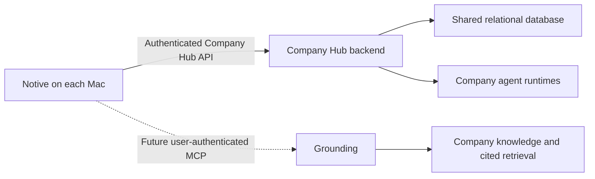

# Product vision

Notive is the private company intelligence workspace for Ubundi and First Motive. It connects conversations, company knowledge, people, and AI agents in one internal application.

Each person has a private workspace on their Mac. The person chooses which meetings, notes, and other work become part of the shared Company Hub. People and agents can then work from the same approved company context.

> Capture work locally. Share context with intent. Give people and agents the same trusted company memory.

This document describes the product direction. It does not approve a shared-service architecture or change the local-first boundaries in [System architecture](architecture.md).

## Product promise

Notive gives the company one trusted place to:

- capture conversations and decisions;
- build shared working memory;
- understand what people and agents work on;
- direct company agents and review their output;
- find knowledge across private and shared scopes; and
- see important company activity and its source.

Notive is more than a meeting assistant, intranet, chat tool, or agent dashboard. It is the operating workspace where company conversations become useful memory and that memory supports work by people and agents.

The long-term product category is a **company intelligence workspace**. A **company intelligence operating system** describes the larger ambition, but it must not imply that Notive replaces every specialist company system.

## Two explicit scopes

Notive has two scopes. The interface and service boundaries must keep them clear.

### My Workspace

My Workspace is private and local. It includes meeting capture, transcription, notes, summaries, Dictation, Ask, and local search. This data stays on the person's Mac unless the owner takes an explicit share action.

### Company Hub

Company Hub contains only company-visible information. It includes items that owners chose to share, approved company knowledge, company agents, people, agent threads, search results, and activity.

Nothing crosses from My Workspace to Company Hub by default. Sharing is a per-item choice. The owner must be able to see the sharing state and withdraw a shared item.

## Highest-priority privacy invariant

**Sensitive personal content stays on the person's Mac.** This is a product invariant and a release requirement, not an optional setting or later hardening task. A shared backend, Grounding connection, or company agent must not weaken it.

Local-only content includes:

- private meetings, notes, dictation, drafts, and search history that the owner did not share;
- meeting recordings and the acoustic features used for local voice grouping;
- credentials, authentication tokens, and recovery information;
- private contact details and personal profile information that the company workspace does not need;
- health, financial, identity, family, and other personal-life information;
- private employment information such as compensation, performance, disciplinary, or wellbeing records; and
- any content that the owner marks as private or that company policy excludes from shared systems.

The shared company scope can contain the minimum work identity needed for collaboration, such as a person's name, company, role, and stated work focus. It must not become a general employee profile or personnel system.

Before Notive shares meeting or note text, it must:

1. show the exact content and destination to the owner;
2. detect and remove likely sensitive personal content on the Mac;
3. let the owner edit or cancel the share;
4. send only the approved text and minimum metadata; and
5. record what was shared without copying the private source into the shared database.

Local detection is a safeguard, not proof that content is safe. Owner review remains required. Notive must not send private content to an external service to decide whether that content is private.

Sensitive personal content must also stay out of analytics, crash reports, logs, notifications, agent prompts, agent output, search indexes, embeddings, caches, and backups outside the Mac. Automated agents must use the same boundary as the interface and must not share local context on a user's behalf.

If Notive cannot prove that a write stays within the approved shared content, it must fail closed and keep the content local.

## The company intelligence loop

The central product loop is:

```text
Conversation -> knowledge -> company memory -> agent work -> visible outcomes
```

1. Meetings capture what people discussed and decided.
2. A person reviews the local record and chooses what to share.
3. Shared Context makes the approved material part of the company's working memory.
4. People and agents use that memory to answer questions and perform work.
5. Agent runs, shared outputs, decisions, and other important changes appear in Activity.
6. Search helps a person find private and shared knowledge without exposing private material to other users.

This loop must preserve provenance. A shared fact, answer, or agent output should remain connected to its source where possible.

## Product areas

### Company

Company is the current company view. It shows what Ubundi and First Motive shared, decided, and ran. It combines important measures, recent shared work, agent state, and open activity without becoming a general analytics dashboard.

### Agents

Agents are a visible part of the company workforce. Each agent has a name, role, purpose, status, runs, company-visible threads, and reviewable output. An agent must not appear to have access or authority that it does not have.

### Shared Context

Shared Context is the company's working memory. It contains approved meetings, notes, briefs, and agent output. Every item shows its source, owner or contributor, and sharing time.

### People

People shows the human and agent organisation. It helps the team understand roles, company membership, current focus, and availability. Agents remain clearly marked so the interface does not present them as people.

### Search

Search is one retrieval experience across the user's local workspace and the shared company scope. Results must show their source and scope. A local result can be shown to its owner without making that result visible to the company.

### Activity

Activity is a company-visible history of important actions and outputs. It shows who or what acted, what happened, when it happened, and relevant source detail. It supports awareness and review; it is not employee surveillance.

## People and agents use the same context with different authority

People and agents can use the same shared company memory, but they do not have the same identity or authority.

- A person acts through their own user account.
- An agent acting for a person must not retrieve more information than that person can access.
- A company agent with independent duties needs its own explicit identity, access policy, and audit history.
- A shared service credential must never bypass user or agent access rules.
- Agent output must identify the agent and the source context used to produce it.

## Future Grounding connection

Notive is expected to connect to **Grounding**, the company knowledge system in the `grounding_ai` repository. The current local working copy is at:

```text
/Users/matthew-schramm-ubundi/Workspace.nosync/Personal/grounding_ai
```

Grounding ingests company sources such as Slack, Google Drive, GitHub, Gmail, web pages, local documents, and meeting notes. It retrieves cited knowledge under per-user access control. In the combined product direction:

- Notive is the native personal and company operating workspace.
- Grounding is the installation-owned company knowledge and retrieval system.
- Notive connects to Grounding through the Model Context Protocol (MCP) when Grounding's MCP service is implemented and approved.
- Each Notive user connects with their own Grounding user account.
- Every MCP request carries an authenticated Grounding principal. Grounding remains responsible for access checks, citations, and query audit.
- Notive and its agents show only records that Grounding permits that principal to retrieve.
- Notive stores any local account secret or token in Keychain and does not write it to the Notive database, logs, or shared context.

The Grounding MCP service does not exist yet. Grounding tracks it as a deferred, approval-gated phase that depends on its access-control and audit requirements. Notive must not simulate the connection with broad API credentials or weaken either product's trust boundary.

Before implementation, an accepted architecture decision must define:

- the sign-in and account-linking flow;
- MCP transport and session authentication;
- how a Notive user maps to a Grounding principal;
- whether company agents use a user principal or a separate agent principal;
- token storage, renewal, revocation, and sign-out;
- query and agent-run audit behavior;
- citation and source rendering in Notive;
- offline, unavailable, and partial-result behavior; and
- the separate write path for sharing or withdrawing meeting content.

The MCP retrieval connection must not silently turn every local meeting into company knowledge. Publishing a meeting from Notive to the Company Hub or Grounding remains a separate, explicit owner action.

Questions sent to Grounding leave the Mac and become subject to Grounding's query audit. Notive must make this scope clear before submission. A question that contains sensitive personal content must stay in local Ask and must not be sent through MCP.

## Product principles

### Local by default

Capture, recordings, sensitive personal content, and private thinking stay on the Mac. A connected company service does not change the default scope.

### Share with intent

The owner chooses what enters the shared company scope. The product shows the choice before and after sharing.

### Access follows identity

Every shared read and write has an accountable person or agent identity. Access rules apply at retrieval time and fail closed.

### Sources stay visible

Search answers, shared knowledge, and agent output keep citations or source links where possible. Notive must help a person verify why an answer exists.

### Agents are observable

The team can see an agent's role, current state, runs, company-visible conversation, and output. Automation must not become invisible company activity.

### Activity is for coordination

Activity helps the team understand work and changes. It must not become passive monitoring of private work or personal behaviour.

## Current implementation state

The native My Workspace features are implemented and use local data.

The Company Hub interface and its service contract are implemented. The default service is disconnected, so its reads are empty and its writes fail safely. No Company Hub screen currently sends local data to a shared service.

Grounding already has company-source ingestion, cited retrieval, user identity, and per-user access controls in its proof of concept. Its MCP service and the Notive integration are not implemented.

## Functionality still to implement

Yes, Company Hub needs a backend and shared database. The local SQLite database belongs to one person's private workspace. It cannot coordinate multiple users, shared items, company agents, permissions, or activity across Macs.

The likely system shape is:



This diagram is a product-level proposal, not an accepted deployment design. An ADR must select the backend, database, hosting, authentication, and transport.

### Data ownership

The systems have different responsibilities:

| System | Responsibility | Must not become |
| --- | --- | --- |
| Local Notive SQLite | Private meetings, transcripts, notes, summaries, settings, and local search | A shared company database |
| Company Hub database | Users, memberships, shared-item metadata, agent registry, threads, run state, activity, permissions, and unread state | A copy of every private workspace |
| Grounding | Ingested company knowledge, access-controlled retrieval, citations, and knowledge relationships | The authority for Company Hub operational state unless an ADR explicitly assigns that role |
| Shared object storage, if needed | Large shared files or attachments | A default destination for private recordings |

A relational database such as PostgreSQL is a likely fit for Company Hub because accounts, permissions, threads, activity, and sharing relationships need transactions and clear constraints. This is not yet a selected technology. If the first version shares only transcript text, notes, and metadata, it might not need object storage. Shared audio or large attachments would add that requirement.

### Shared backend foundation

Implement a network service that conforms to the behavior expected by `CompanyHubProviding`. It needs:

- a versioned authenticated API;
- persistent shared data and database migrations;
- company membership and workspace isolation;
- validation, rate limits, and idempotent writes;
- pagination and bounded queries for lists, threads, activity, and search;
- reliable error responses that Notive can explain;
- backup, restore, retention, and deletion procedures; and
- development, test, and production environments.

### Accounts, identity, and access

Implement:

- user sign-in, sign-out, session renewal, and account recovery;
- membership in Ubundi, First Motive, or the shared company workspace;
- roles for members, administrators, and agents;
- per-item read, share, withdraw, and delete permissions;
- an identity for each company agent;
- secure token storage in macOS Keychain;
- access checks on every backend read and write; and
- an audit record for sensitive reads, shares, withdrawals, agent actions, and administration.

The design must decide whether Notive has its own account system or uses the same identity provider and user identity as Grounding. One shared company identity is preferable, but it must not be assumed until the account mapping is designed and tested.

### Sharing and synchronization

Implement the complete sharing lifecycle:

- show exactly which local meeting or note will be shared;
- run sensitive-content detection and redaction locally before any network write;
- publish only the selected content and required metadata;
- record the owner, source, sharing time, and current sharing state;
- prevent duplicate shares when a request is retried;
- let the owner update or withdraw a shared item;
- propagate withdrawals to Company Hub search and downstream knowledge systems;
- define what happens to citations and agent output after a source is withdrawn;
- synchronize shared state across Macs;
- handle offline use, retries, conflicts, and partial failures;
- keep meeting recordings and voice-grouping features local; and
- block a share when its approved payload cannot be separated from local-only content.

### Company Hub product surfaces

Connect the existing screens to real shared behavior:

- **Company:** shared measures, recent knowledge, agent status, and open activity;
- **Agents:** agent roster, run state, company-visible threads, message sending, and output review;
- **Shared Context:** shared items, filters, provenance, share, update, and withdrawal;
- **People:** company directory, roles, current focus, status, and distinct agent entries;
- **Search:** one experience that combines the user's private local results with permitted shared results without merging their visibility; and
- **Activity:** ordered events, unread state, mark-all-read, and links to their source objects.

The application also needs loading, empty, unavailable, permission-denied, partial-result, and retry states for every connected screen.

### Agent operations

The current interface represents agents, but no agent runtime is connected. Implement:

- an agent registry with roles, owners, capabilities, and status;
- authenticated messaging and company-visible threads;
- run creation, progress, cancellation, completion, and failure states;
- durable run history and reviewable output;
- source and citation capture for agent output;
- explicit approval for actions that affect external systems or other people;
- permissions based on the acting user or the agent's own principal; and
- an audit trail that distinguishes a person, an agent, and the person who requested a run.

### Grounding and MCP

Grounding must complete and approve its MCP service before Notive can depend on it. The integration then needs:

- a Notive account-linking flow for each Grounding user;
- secure MCP session authentication and token renewal;
- a tested mapping from the Notive account to the Grounding principal;
- tools for permitted company search, entity lookup, related knowledge, people expertise, and recent activity;
- citations and source metadata that Notive can render;
- Grounding access checks and query audit for every tool call;
- a clear warning that an MCP question leaves the Mac and enters Grounding's audit history;
- a local-only path for questions that contain sensitive personal content;
- clear unavailable, expired-session, denied, and partial-result behavior; and
- a separate approved ingestion or publishing path for shared Notive content.

MCP retrieval does not replace the Company Hub backend. Grounding can answer questions from company knowledge, but Company Hub still needs an operational source of truth for memberships, agent conversations, run state, sharing state, activity, and unread state. A later ADR can combine responsibilities only if Grounding provides the required operational contracts without weakening its knowledge and access boundaries.

### Security and operations

Before the shared service can be used by the company, implement and verify:

- encrypted network transport and secure secret management;
- least-privilege service and database access;
- structured logs that do not contain meeting content or credentials;
- local-only processing for sensitive-content detection and redaction;
- monitoring for availability, failed jobs, denied access, and synchronization errors;
- database backups and tested recovery;
- account removal, content retention, export, and deletion workflows;
- dependency, vulnerability, and access reviews;
- end-to-end tests for privacy boundaries, local redaction, sharing, withdrawal, search, and agent permissions; and
- release-blocking tests that prove local-only content does not enter network requests, logs, analytics, shared search, agent context, or remote caches.

### Decisions required before implementation

Write and accept ADRs for:

- Company Hub service ownership and hosting;
- the shared database and migration strategy;
- account identity, authentication, and organisation membership;
- authorization and agent principals;
- the API and synchronization protocol;
- shared-content storage, retention, withdrawal, and deletion;
- the local-only sensitive-content classification, detection, and enforcement boundary;
- Grounding MCP authentication and principal mapping; and
- agent runtime, approval, and audit boundaries.

The expected delivery order is:

1. Keep the local and shared scope boundary explicit in the product.
2. Define and approve identity, authorization, and the shared Company Hub architecture.
3. Build the backend, shared database, account flow, and sharing lifecycle.
4. Connect shared items, people, search, and activity through `CompanyHubProviding`.
5. Connect agent identities, threads, runs, review, and audit.
6. Complete and approve Grounding's MCP service and identity mapping.
7. Connect Notive to Grounding with each user's account and enforce cited, audited retrieval.
8. Expand agent workflows only after their access, approval, review, and audit rules are verified.

## Success

Notive succeeds when:

- sensitive personal content stays on the person's Mac in every supported workflow;
- important conversations strengthen company memory;
- people can find trusted knowledge without asking who remembers it;
- agents work from approved context and produce reviewable output;
- the team can understand what the company knows, what it is doing, and why; and
- private work remains private until its owner chooses otherwise.
